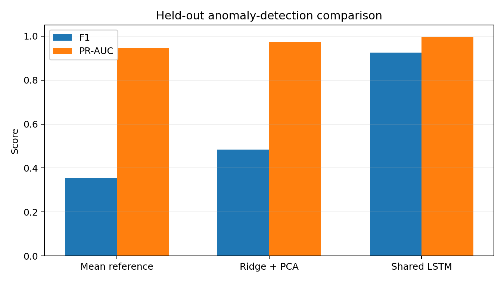
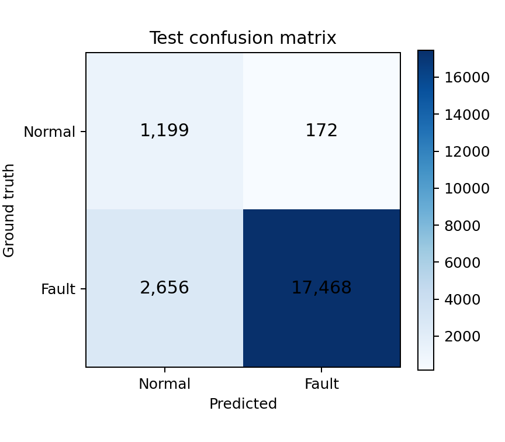
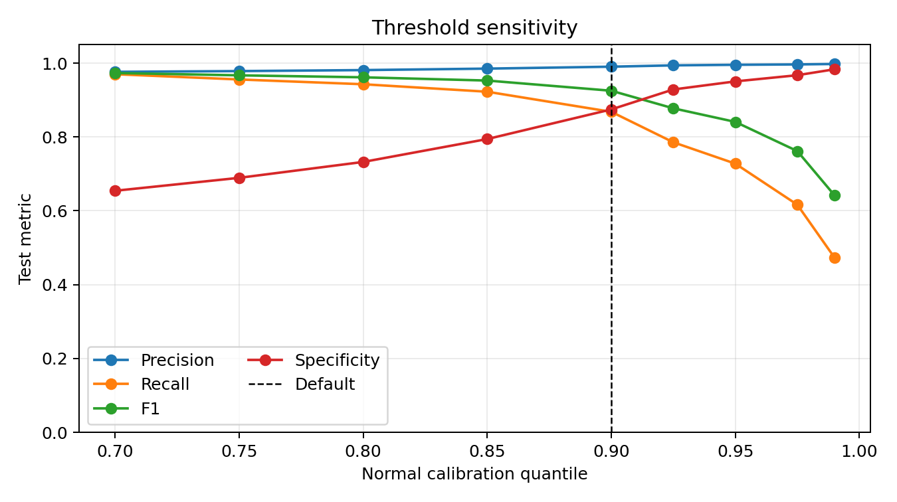

# Multi-Zone HVAC Anomaly Detection

I worked on this problem during my summer 2025 research internship at the
University of Miami. The aim was to detect abnormal HVAC operation without
training a classifier on individual fault cases.

The basic idea is to learn how ten room temperatures should behave from the
rest of the building measurements during normal operation. When the measured
temperatures stop agreeing with those learned relationships, the prediction
and reconstruction errors increase and produce an anomaly score.

This repository contains both the [original Colab exploration](notebooks/exploratory/RTU_supervised_original.ipynb)
and the cleaned experiment used for the results below.

## Why this is not supervised fault classification

The ten room-temperature columns are regression targets, not fault labels. The
model receives a four-minute window of other RTU, VAV, humidity, energy,
occupancy, setpoint, and time features and predicts the room temperatures at
the end of that window.

The `Fault Detection Ground Truth` column is never an input or training target.
It is used to identify a known-normal reference set and to evaluate the anomaly
scores after training. This is therefore a normal-behavior, semi-supervised
anomaly detector rather than a supervised fault classifier.

## Model

The cleaned model has three parts:

1. A shared LSTM encoder learns a 32-dimensional representation of each sensor
   window.
2. Ten small room-specific heads predict the room temperatures.
3. One shared reconstruction head reconstructs the current input vector.

For room `r` at time `t`, the raw score is

```text
score(r, t) = 0.6 * temperature_prediction_error
            + 0.4 * input_reconstruction_error
```

Each room score is normalized using only normal calibration windows. The global
score is their mean, and the default threshold is the 90th percentile of the
normal calibration scores.

I excluded the ten `VAV Box: Room ... Air Temperature` columns from the inputs.
They are close proxies for the ten prediction targets and made the experiment
look easier than it really was. Removing them improved both the method and the
result.

## Data split

The CSV contains 30,240 one-minute rows, 51 retained input features, and ten
room-temperature targets. It also contains long gaps between recorded periods.

- Normal observations are divided into disjoint 60-minute blocks.
- Blocks are stratified by time of day and assigned to training, calibration,
  or normal test data.
- Overlapping windows cannot appear in more than one split.
- Sequences never cross a timestamp gap.
- Fault windows are kept out of training and threshold calibration.
- Missing values are forward-filled only within a contiguous period, with
  medians fitted on training data as the fallback.

The final run used 7,094 training windows, 1,386 normal calibration windows,
and 21,495 test windows. The test set contains 1,371 normal and 20,124 fault
windows, so I report balanced accuracy and specificity in addition to ordinary
accuracy.

## Results

The numbers below were produced by `run_experiment.py` with seed 42. The
threshold is calculated from normal calibration scores; fault labels are used
only to compute the table.

| Metric | Shared LSTM |
|---|---:|
| Accuracy | 0.868 |
| Balanced accuracy | 0.871 |
| Precision | 0.990 |
| Recall | 0.868 |
| F1 | 0.925 |
| Specificity | 0.875 |
| ROC-AUC | 0.943 |
| PR-AUC | 0.995 |

### Baselines

Both baselines use the same normal-only training, calibration, and test blocks.

| Method | F1 | ROC-AUC | Recall | Specificity |
|---|---:|---:|---:|---:|
| Mean reference | 0.353 | 0.605 | 0.216 | 0.908 |
| Ridge regression + PCA | 0.485 | 0.725 | 0.322 | 0.916 |
| Shared LSTM | **0.925** | **0.943** | **0.868** | 0.875 |





The full output includes per-room metrics, the score timeline, prediction plots,
training curves, and a threshold-sensitivity analysis. The sensitivity plot is
important because the operating threshold changes the trade-off between missed
faults and false alarms.



### Proxy-feature check

Using the same split and 90th-percentile threshold, keeping the ten VAV room
temperature proxies gave 0.874 F1 and 0.912 ROC-AUC. Removing them increased
the scores to 0.925 and 0.943 respectively. The cleaned experiment uses the
more conservative feature set.

## Running the experiment

```bash
python -m venv .venv
source .venv/bin/activate
python -m pip install -r requirements.txt
```

Download the data as described in [`data/README.md`](data/README.md), then run:

```bash
PYTHONPATH=src python run_experiment.py \
  --data data/RTU_CLEAN_faultandnofault.csv
```

The script trains the two baselines and the LSTM, saves genuine metrics and
figures under `results/`, and writes model weights and preprocessing objects to
the gitignored `artifacts/` directory.

Run the tests with:

```bash
PYTHONPATH=src python -m pytest -q
```

## Repository layout

```text
.
├── data/                         # data source and placement instructions
├── notebooks/exploratory/        # original Colab notebook and outputs
├── results/                      # metrics, manifests, and generated figures
├── src/hvac_anomaly/             # preprocessing, model, scoring, evaluation
├── tests/                        # split and scoring tests
└── run_experiment.py             # complete experiment entry point
```

## Limitations

- The benchmark assumes that a set of known-normal observations is available.
- The ground truth says whether a fault is present, but not which component or
  room caused it. Room scores show where prediction consistency changed; they
  are not causal diagnoses.
- The dataset contains separated experimental periods rather than one
  continuous deployment. The block split measures performance across these
  recorded conditions, not long-term deployment drift.
- The threshold should be recalibrated for a new building and for the acceptable
  false-alarm rate of that application.

## Dataset reference

The data comes from the public DOE/LBNL collection **Data Sets for Evaluation
of Building Fault Detection and Diagnostics Algorithms**:

- Dataset: https://catalog.data.gov/dataset/data-sets-for-evaluation-of-building-fault-detection-and-diagnostics-algorithms
- Dataset DOI: https://doi.org/10.25984/1824861
- Data descriptor: https://doi.org/10.1038/s41597-020-0398-6

The DOE catalog lists the dataset under CC BY 4.0. The raw CSV is not duplicated
in this repository.

